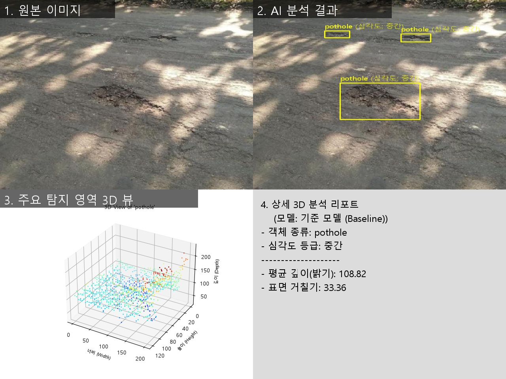
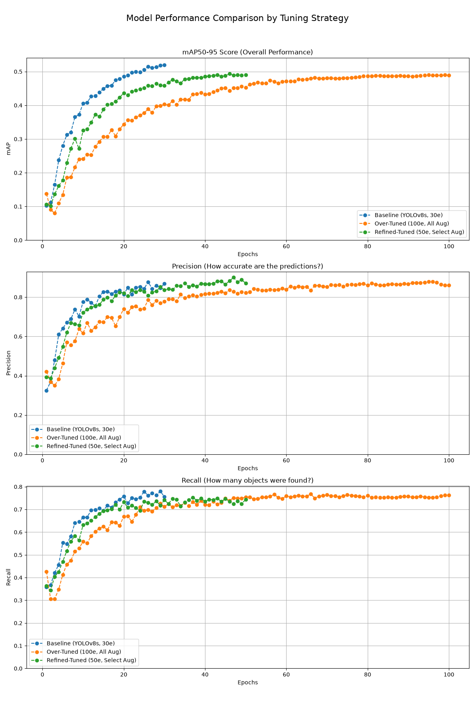

# 코멘토 Computer Vision 직무부트캠프 (2025.08)

OpenCV 기초에서 시작해 YOLOv8 모델 학습·튜닝을 거쳐, **도로 파손을 탐지하고 심각도를 분석하는 GUI 애플리케이션**을 완성하기까지의 4주 과정을 정리한 저장소입니다.

| 항목 | 내용 |
| --- | --- |
| 기간 | 2025.08 (4주) |
| 형태 | 개인 프로젝트 (코멘토 CV 직무부트캠프 과제) |
| 언어 | Python |
| 핵심 기술 | OpenCV, YOLOv8 (Ultralytics), Tkinter, Matplotlib, pandas, pytest |
| 최종 결과물 | [AI 도로 파손 탐지 및 심각도 분석 시스템](./week4/task_road_damage_analysis/) |

## 한눈에 보기

| 주차 | 주제 | 한 일 |
| --- | --- | --- |
| [1주차](./week1/) | Git & OpenCV 기초 | HSV 색상 공간을 이용한 빨간색 영역 필터, Hugging Face 데이터셋 기반 전처리·데이터 증강 파이프라인 |
| [2주차](./week2/) | Unit Test & 2D→3D 변환 | 이미지 밝기로 깊이 맵과 3D 포인트 클라우드 생성, `pytest` 테스트 4개, Matplotlib 3D 시각화 |
| [3주차](./week3/) | 모델 학습 & 성능 분석 | 가위·바위·보 데이터셋으로 YOLOv8 학습, 데이터 증강 / 모델 크기 / 학습 길이 3가지 변수를 통제 실험하고 mAP 비교 |
| [4주차](./week4/) | **최종 프로젝트** | 도로 파손(균열·포트홀) 탐지 모델 학습·튜닝 + 3D 심각도 분석 + Tkinter GUI 대시보드 |

## 최종 프로젝트: AI 도로 파손 분석기

도로 사진을 넣으면 균열(crack)과 포트홀(pothole)을 찾아내고, 파손 영역마다 심각도를 **높음 / 중간 / 낮음**으로 매겨 4분할 대시보드로 보여 주는 데스크톱 프로그램입니다.



*테스트 세트 이미지를 기준 모델로 분석한 결과. 그림자가 진 노면에서 포트홀 3개를 찾고, 가장 큰 파손의 3D 포인트 클라우드와 심각도 리포트를 보여 줍니다.*

**처리 흐름**

1. **탐지:** 직접 학습한 YOLOv8s 모델이 이미지에서 파손 영역(경계 상자)을 찾습니다.
2. **2D→3D 변환:** 각 파손 영역(ROI)의 밝기를 깊이(Z)로 삼아 3D 포인트 클라우드를 만듭니다. 2주차에서 만든 기법을 재사용했습니다.
3. **심각도 판정:** Z값의 평균(어두울수록 깊다고 봄)과 표준편차(표면 거칠기)를 임계값과 비교합니다.
   - 평균 < 80 또는 표준편차 > 45 → **높음**
   - 평균 < 150 또는 표준편차 > 30 → **중간**
   - 그 외 → **낮음**
4. **대시보드:** 4개 패널을 `cv2.hconcat` / `cv2.vconcat`으로 합쳐 화면에 표시하고, 이미지 파일로 저장할 수 있습니다.

**모델 학습 결과**

[Roboflow Crack and Pothole 데이터셋](https://universe.roboflow.com/road-damage-detection-n2xkq/crack-and-pothole-bftyl)(학습 10,244장 / 검증 731장, 클래스: crack, pothole)으로 사전 학습된 YOLOv8s를 3가지 전략으로 미세 조정했습니다. 수치는 각 모델의 `best.pt`를 검증 세트로 평가한 값입니다(RTX 3070).

| 실험 | 설정 | mAP50 | mAP50-95 | Precision | Recall | 학습 시간 |
| --- | --- | --- | --- | --- | --- | --- |
| **기준 (Baseline)** | 30 epochs, 기본 증강 | 0.814 | **0.518** | 0.869 | **0.756** | 약 50분 |
| 정제된 튜닝 | 50 epochs, 회전·이동·크기·좌우 반전만 | 0.792 | 0.492 | **0.888** | 0.731 | 약 1시간 20분 |
| 과도한 튜닝 | 100 epochs, 상하 반전·원근·Mixup 등 전부 | **0.815** | 0.490 | 0.879 | 0.753 | 약 2시간 45분 |



- **결론:** 증강을 더하고 학습을 오래 한다고 성능이 오르지 않았습니다. 가장 짧게 학습한 기준 모델이 종합 지표(mAP50-95)에서 가장 높았고, 과도한 튜닝은 3배 넘는 시간을 들이고도 mAP50만 비슷했습니다. 그래프를 보면 과도한 튜닝은 60에폭 이후 약 0.49에서 정체한 반면, 기준 모델은 30에폭에서도 아직 오르는 중이라 기본 설정으로 더 길게 학습하는 것이 다음 실험 후보입니다.
- **해석(가설):** 이 데이터셋은 1만 장 규모라 YOLOv8의 기본 증강(Mosaic, HSV, 좌우 반전, 크기 ±50%)만으로도 다양성이 충분했던 것으로 보입니다. 상하 반전·원근 왜곡처럼 실제 도로 사진에서 나오지 않는 변형은 박스 위치 정밀도(mAP50-95)를 낮췄을 가능성이 있습니다. 정제된 튜닝은 크기 변화 폭을 ±20%로 줄였는데, 이것이 오히려 멀리 있는 작은 파손에 대한 학습을 줄였을 수 있습니다. 각 요인을 하나씩 바꾸는 추가 실험으로 확인할 수 있습니다.
- 이 결과에 따라 앱의 기본 모델은 기준 모델로 두고, 정제된 튜닝 모델은 비교용으로 선택할 수 있게 했습니다.

**구현에서 신경 쓴 점**

- **통제된 튜닝 실험:** 같은 모델(YOLOv8s)과 데이터셋에서 증강 범위와 학습 길이만 바꿔 비교하고, 결과를 `results.csv`에서 뽑아 그래프로 정리하는 스크립트(`4_analyze_results.py`)까지 만들었습니다.
- **GUI가 멈추지 않는 구조:** 모델 로드와 추론은 `threading.Thread`에서 실행하고, 화면 갱신은 `root.after()`로 메인 스레드에 넘겨 Tkinter의 스레드 안전성을 지켰습니다. 모델은 처음 선택할 때 한 번만 로드해 캐시합니다.
- **역할 분리와 테스트:** 계산·시각화 함수는 `utils_road_damage_analyzer.py`에, GUI는 `run_road_damage_analyzer.py`에 분리했습니다. 유틸 함수는 `unittest.mock`으로 폰트 로딩과 Matplotlib을 대체해 외부 의존성 없이 테스트합니다(정상 입력, 빈 입력, 잘못된 타입, 심각도 3단계, 플롯 디코딩 실패 등 8개 테스트).
- **한글 출력:** OpenCV `putText`는 한글을 그리지 못하므로 Pillow로 텍스트를 그린 뒤 다시 OpenCV 이미지로 변환했습니다.

**한계와 개선 방향**

- 깊이는 실제 측정값이 아니라 **밝기를 깊이로 가정한 근사치**입니다. 그림자나 노면 색에 영향을 받으므로, 실제 서비스라면 스테레오 카메라나 단안 깊이 추정 모델(예: MiDaS, Depth Anything)로 바꾸는 것이 다음 단계입니다.
- 심각도 임계값은 경험적으로 정한 값이라, 라벨이 붙은 심각도 데이터로 검증하거나 학습하는 과정이 필요합니다.

## 폴더 구조

```
comento-cv-assignment/
├── week1/                              # Git & OpenCV 기초
│   ├── task1_basic_red_filter/         #   HSV 빨간색 필터
│   └── task2_additional_huggingface/   #   전처리·데이터 증강
├── week2/
│   └── task_2d_to_3d_conversion/       # 깊이 맵·포인트 클라우드 + pytest
├── week3/
│   └── task_ai_model_analysis/src/     # YOLOv8 학습 실험 1~4, 추론 5, 분석 6
├── week4/
│   └── task_road_damage_analysis/
│       └── src/
│           ├── model_training/         # 기준 / 과도한 튜닝 / 정제된 튜닝 학습 + 비교 그래프
│           ├── utils_road_damage_analyzer.py   # 3D 변환, 심각도 판정, 시각화
│           ├── run_road_damage_analyzer.py     # Tkinter GUI
│           └── test_road_damage_analyzer.py    # 유닛 테스트
├── docs/images/                        # README용 결과 이미지
└── requirements.txt
```

데이터셋, 학습 결과(`runs/`), 모델 가중치(`*.pt`), 출력 이미지(`outputs/`)는 용량 때문에 저장소에 올리지 않았습니다. 각 주차 README에 데이터셋을 받는 방법이 있습니다.

## 실행 방법

Python 3.10 이상, Windows 기준입니다(한글 폰트로 맑은 고딕을 사용).

```bash
git clone https://github.com/Ingoakore/comento-cv-assignment.git
cd comento-cv-assignment
pip install -r requirements.txt
```

**테스트**

```bash
cd week2/task_2d_to_3d_conversion
pytest
```

```bash
cd week4/task_road_damage_analysis/src
pytest test_road_damage_analyzer.py
```

**최종 프로젝트 실행** (데이터셋 준비와 모델 학습은 [4주차 README](./week4/task_road_damage_analysis/) 참고)

```bash
cd week4/task_road_damage_analysis/src/model_training
python 1_run_training_baseline.py
python 3_run_training_refined_tuned.py
cd ..
python run_road_damage_analyzer.py
```

4주차 스크립트는 파일 위치를 기준으로 경로를 찾으므로 어느 폴더에서 실행해도 됩니다. 1~3주차 스크립트는 상대 경로를 쓰므로 **스크립트가 있는 폴더로 이동한 뒤** 실행해야 합니다. GPU가 있으면 [PyTorch CUDA 버전](https://pytorch.org/get-started/locally/)을 먼저 설치하세요. CPU로도 동작하지만 학습이 매우 느립니다.
